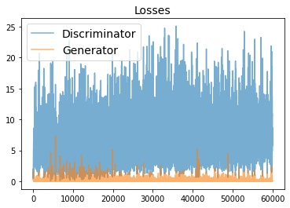
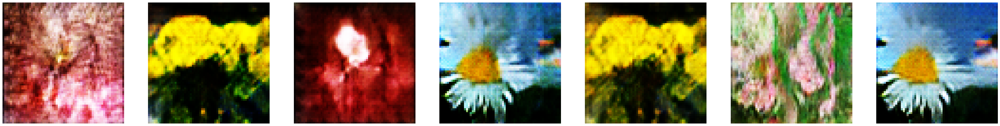

# Flower Image Generation - DCGAN Network

Generating new images of flowers using Keras to implement a Deep Convolutional Generative Adversial Network. 
The model is trained using the Dataset: [tf_flower](https://www.tensorflow.org/datasets/catalog/tf_flowers) ⇒ you can visit dataset on [Know your Data Website](https://knowyourdata-tfds.withgoogle.com//#tab=STATS&dataset=tf_flowers).

New samples generated by the model.

---

## Background 

Generative adversarial networks (GAN's) are an architecture designed to train a neural network to generate novel samples of a given dataset. They generally work by concurrently training two neural networks: one to generate new samples from noise input (the generator) and one that is meant to label samples are real or fake (the discriminator or critic). Both neural networks have a competing training goal, the generator tries to generate samples that trick the critic and the critic is trying to learn to not be fooled by the generator.

## Prerequisites
* python 3.7
* Tensorflow 2
* Jupyter Notebooks

### Colab Jupyter Notebook
It is better to run the Notebook on Colab Pro with GPU and High-RAM.
1. Open
1. Please refer to How to run section

# How to run

To train models, I used the HParams dashboard (you can view results in "Training models with different hyperparamters" section). To train again the model or generate new images, run sections before "Training models with different hyperparameters" to define prerequisite functions to run models.

## How to train
You can follow the instruction in the "Train and Test Models" section to train models.
**Note**: If you want to skip using HParam, which you can see the results of hyperparaemter tuning in "Visualize the results in TensorBoard's HParams plugin" section, skip the "Training models with different hyperparameters" section, and run "Training Best Model" section with desired hyperparameters.

## How to generate new Images
To this end, you need to load the weigths of the models I trained or train your own model, which requires a good GPU and time. You can use the weigths I saved in "Weights" folder, and run the "Load Models by their HDF5 format" cells to generate new images.

# References
1. https://www.mathworks.com/help/deeplearning/ug/train-generative-adversarial-network.html?searchHighlight=Train%20Generative%20Adversarial%20Network%20%28GAN%29&s_tid=srchtitle_Train%20Generative%20Adversarial%20Network%20%2528GAN%2529_1#TrainGenerativeAdversarialNetworkGANExample-1
2. https://www.kaggle.com/alxmamaev/flowers-recognition
3. https://www.tensorflow.org/tutorials/generative/dcgan
4. https://machinelearningmastery.com/how-to-evaluate-generative-adversarial-networks/
5. https://arxiv.org/pdf/1511.06434.pdf
6. https://www.tensorflow.org/tensorboard/hyperparameter_tuning_with_hparams

